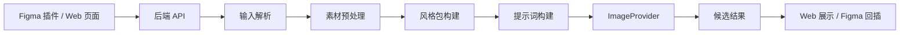

# Brand Style 项目汇报文档

## 1. 项目概述

Brand Style 是一个面向品牌视觉资产生成的 Figma 插件系统。项目目标是让设计师在 Figma 中选中图层或上传参考图后，通过自然语言描述、风格 Skill、材质、配色和形体配置，快速生成符合品牌风格的一组图标候选结果，并支持把结果一键插回 Figma 画布。

当前项目已经完成从 Figma 插件、Web 验证端、Node 后端到生图模型 Provider 的端到端 MVP 链路。后端默认运行在 `http://localhost:5180`，同时提供 Web 演示页、后台管理页和 Figma 插件接口。

## 2. 项目背景

在品牌设计和产品运营场景中，图标、营销素材、功能入口图等视觉资产经常需要保持统一风格，同时又要快速响应不同业务需求。传统流程通常依赖人工反复沟通、手动调整和多轮出图，存在以下问题：

- 风格一致性依赖设计师经验，难以稳定复用。
- 生图提示词难以沉淀，团队协作成本较高。
- AI 生成结果与 Figma 设计工作流割裂，需要手动导入、对齐和管理。
- 不同模型、不同风格方案之间缺少统一的配置和评估入口。

Brand Style 通过“插件入口 + 配置化风格 + 后端编排 + 可插拔生图模型”的方式，把品牌风格生成能力接入设计师的日常工具链，提升从需求到可用视觉资产的效率。

## 3. 项目目标

本阶段以 MVP 验证为主，核心目标包括：

- 跑通 Figma 选区到 AI 生成结果再回插画布的完整链路。
- 支持 Web 端上传素材并验证生成流程。
- 支持模型、Agent、材质、配色、形体架构等后台配置。
- 将生图能力封装为可替换的 `ImageProvider`，便于后续切换不同模型。
- 通过对话式交互承载复杂需求，让用户可以基于选中图片继续描述生成目标。

## 4. 用户价值

对设计师来说，Brand Style 可以把“选中素材、描述需求、生成候选、插入画布”集中在 Figma 内完成，减少在多个工具之间切换的成本。

对产品和运营来说，系统可以沉淀常用风格 Skill、材质模板和配色方案，让同类业务素材具备更稳定的品牌一致性。

对研发和平台侧来说，后端通过统一 API 和 Provider 抽象屏蔽模型差异，后续接入新模型或调整提示词策略时，不需要大幅修改插件和 Web 端。

## 5. 当前实现范围

当前版本已经实现以下能力：

- Figma 插件入口，插件名已调整为 `brand style`。
- Figma 多选图层导出为参考图，并发送给本地后端。
- 对话式需求输入，支持引用“图1、图2”等选中素材。
- 后端生成任务编排，包括输入解析、预处理、风格包构建、提示词构建和模型调用。
- 支持 Mock Provider 和 Fintopia Provider，便于在无真实模型或真实模型不可用时切换。
- 支持生成 1 到 4 张候选结果，并返回给插件或 Web 页面。
- Figma 中支持将选中的生成结果插入画布。
- Web 验证端支持上传素材、选择参数并查看生成结果。
- 后台管理页支持配置模型、Agent、材质、配色、形体架构和运营场景。

## 6. 系统架构

项目采用 monorepo 结构，主要由四部分组成：

- `apps/server`：Node.js + TypeScript 后端服务，负责 API、任务编排、模型调用和配置管理。
- `apps/web`：Web 验证端和后台管理页面，用于演示流程和维护配置。
- `apps/figma-plugin`：Figma 插件，包括插件控制器和 UI 页面。
- `packages/shared`：共享类型、DTO 和风格 preset 定义。

核心架构可以概括为：

## 7. 核心流程

### 7.1 Figma 插件流程

用户在 Figma 中选中一个或多个图层后，插件会将选区导出为图片资源。用户可以选择模型、Agent、材质、配色、形体结构等参数，并在对话框中输入生成需求。后端收到请求后，会将用户输入、选中图片和配置项组合成生成任务，调用对应模型生成候选结果。用户选择满意结果后，插件会把图片作为新图层插入 Figma 画布。

### 7.2 Web 验证流程

Web 端用于快速验证后端生图链路。用户可以上传素材、选择输入类型和生成参数，页面会通过 `POST /api/tasks` 创建生成任务，并展示后端返回的候选结果。该入口适合演示基础流程和调试后端能力。

### 7.3 后台配置流程

后台管理页用于维护模型、Agent、Style Skill、材质、色板、形体架构和运营场景。配置会保存到本地 `data/config.json`，当前定位是本地开发和演示使用，正式产品化前还需要补充账号权限、密钥加密和审计能力。

## 8. 技术亮点

### 8.1 端到端设计工作流

项目不是单纯的生图接口调用，而是打通了 Figma 设计环境、后端任务编排和生成结果回插。用户不需要离开设计工具，就可以完成从参考图到候选结果的闭环。

### 8.2 可插拔模型能力

后端通过 `ImageProvider` 抽象生图模型。当前已经具备 Mock Provider 和 Fintopia Provider，后续如果更换其他图像模型，只需要新增 Provider 或调整配置，不需要重写插件和 Web 交互。

### 8.3 配置化风格控制

项目将品牌风格拆成 Agent、材质、配色、形体架构、负向规则等结构化配置。相比一次性手写 prompt，这种方式更适合团队沉淀可复用的品牌生成规范。

### 8.4 对话式生成体验

Figma 插件支持对话式输入，并能识别用户提到的“图1、图2”等参考图编号。如果用户引用了不存在的图片，后端会给出明确提示，避免生成任务使用错误素材。

### 8.5 本地演示和后台管理一体化

同一个后端服务同时承载 Web 演示页、后台配置页和插件 API，便于本地演示、快速迭代和问题定位。

## 9. 当前演示方式

后端服务启动后，可以通过以下入口演示：

- Web 验证端：`http://localhost:5180`
- 后台管理页：`http://localhost:5180/admin.html`
- 健康检查接口：`http://localhost:5180/api/health`
- Figma 插件：加载 `apps/figma-plugin/manifest.json`

推荐演示路径：

1. 打开 Figma 插件，展示插件名称 `brand style`。
2. 在 Figma 中选中一个图层，点击添加选中图。
3. 选择模型、Agent、材质、配色和形体结构。
4. 输入需求，例如“生成一组金融图标，包含额度、安全、客户、还款”。
5. 展示候选结果生成过程。
6. 选择一张结果并插入 Figma 画布。
7. 打开后台管理页，展示模型和风格 Skill 的配置能力。

## 10. 当前限制

当前版本仍处于 MVP 阶段，有一些限制需要在汇报中说明：

- 任务数据主要保存在内存中，服务重启后任务记录会丢失。
- 后台配置当前面向本地开发，没有登录、权限和密钥加密。
- Web 直连任务和 Figma 对话任务的 Prompt Orchestrator 能力还不完全一致。
- README 中提到 Result Scorer，但当前主生成链路还没有真正接入评分模块。
- 素材预处理目前偏规则化和描述化，还不是完整的计算机视觉处理管线。
- Figma 插件和后端都主要服务于本地演示，正式部署前需要完善稳定性、异常处理和安全策略。

## 11. 后续规划

下一阶段可以从产品化、稳定性和效果提升三个方向推进：

- 接入结果评分能力，对候选图进行质量、品牌一致性和结构保真度排序。
- 统一 Web 和 Figma 生成链路，让 Prompt Orchestrator 在不同入口下表现一致。
- 增加任务持久化，保存历史生成记录和用户选择结果。
- 增加用户登录、权限控制、API Key 加密和操作审计。
- 增加自动化测试，覆盖后端 API、配置读取、Provider 切换和插件通信协议。
- 补充更多品牌 Style Skill、材质模板和场景模板，提高可演示案例丰富度。
- 支持更多输出类型，例如营销插画、应用入口图、活动图标和功能卡片视觉。

## 12. 汇报总结

Brand Style 当前已经完成一个可演示、可迭代的品牌风格生成 MVP。它的核心价值在于把 AI 生图能力从单点工具升级为设计工作流的一部分：用户可以在 Figma 中基于真实图层和参考素材发起生成，通过后台配置沉淀品牌风格，再把生成结果直接回插到设计画布。

从技术实现看，项目已经具备清晰的模块边界和扩展方向：前端负责交互，插件负责设计工具集成，后端负责生成任务编排，Provider 负责模型适配。后续只要继续补齐安全、持久化、评分和测试能力，就可以从本地 MVP 逐步演进为面向团队使用的品牌视觉生成工具。
